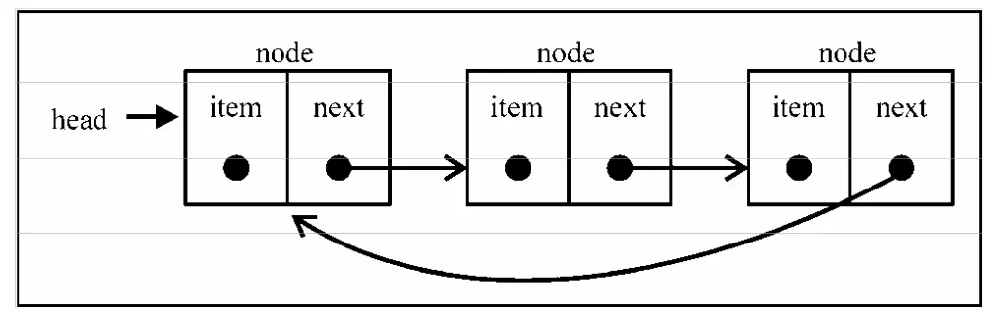

## 栈

> **栈（Stack）** 是一种遵循 _先进后出（LIFO）_ 的原则的有序集合。
> 新添加的或待删除的元素都保存在站的末尾，称为栈顶，另一端就叫栈底。
> 在栈里，新元素都靠近栈顶，旧元素都接近栈底。

比如：一摞书、或者餐厅里的盘子。


## 队列

> **队列（Queue）** 是一种遵循 _后进先出（FIFO）_ 原则的有序的项。
> 队列在尾部添加新元素，并从顶部移除元素，最新添加的元素必须排在队列的尾部。

比如：餐厅里的排队取餐。


- 优先队列
  设置优先级，然后在正确的位置添加元素
- 循环队列
  每次执行都把队列的第一个元素移除，放置尾部。

## 链表

> **链表（LinkedList）** 储存有序的元素集合，每个元素都有一个储蓄元素本身的节点和一个指向下一个元素的引用（也称为指针或者链接）组成。

比如：寻宝游戏或者火车的一系列车厢。


例子：

```js
// {element: 'A', next:{element: 'B', next:{..}}}
(A) => (B) => C;
// 在 A 和 B 之间插入 E
(A) => (E) => (B) => C;
// 删除 E
(A) => (B) => C;
```

- 添加元素
  1. 把 A 的 next 指向 E
  2. 把 E 的 next 指向 B
- 删除元素
  1. 把 A 的 next 指向 B
  2. 把 B 的 next 指向 C

### 双向链表

链表是双向的，一个元素链向下一个元素同时也链向上一个元素。


### 循环链表

每个元素不仅链向下一个元素和上一个元素，而且头部和尾部的元素也相连，形成一个闭环。

```js
head.prev = tail.next;
```



### 图片来源：

- [掘金-在 JavaScript 中学习数据结构与算法](https://juejin.im/post/594dfe795188250d725a220a)

## 集合

集合是由一组无序且唯一（即不能重复）的项组成的。这个数据结构使用了有限集合相同的数学概念，在数学中，集合是一组不同的对象（的集）
你可以把集合想象成一组没有重复元素，也没有顺序的数组（其实在 JS 中就是对象，ES6 中的 Set 数据结构就是是集合的实现,它类似数组，但是成员都是唯一的。 ）。
集合的一些操作：

- 并集：对于给定两个集合，返回一个包含两个集合中所有元素的新集合。
- 交集：对于给定两个集合，返回一个包含两个集合中共有元素的新集合
- 差集：对于给定两个集合，返回一个所有存在于第一个集合且不存在与第二个集合的元素的新集合
- 子集：对于给定两个集合，验证一个集合，是否是另一个元素的子集。

## 字典

> 字典和集合很相像，集合是以[值, 值]的形式储存的。字典则是以[键, 值]的形式来储存元素的，字典也称为 “映射”
> 字典储存的是[键, 值]对，其中键名是用来查询特定元素的。
> EACAScript 6 中的 Map 数据结构就是字典的一种实现，它类似对象。

### 散列表（散列映射 Hash）

- 散列算法：尽可能快得在数据结构中找到一个值。
- 处理散列表中的冲突（冲突原因：同一个位置只能存放一个值）
  - 分离链接：为散列表的每一个位置都创建一个链表并将元素存放在里面。
  - 线性探查：当新元素加入列表时，如果索引为 index 的位置已被占据，则尝试 index+1 的位置，依次类推，已找到空位置未知。
  - 双散列法
- 更好的散列函数 djb2

```js
let djb2HashCode = function(key) {
  let hash = 5371;
  for (let i = 0; i < key.length; i++) {
    hash = hash * 33 + key.charCodeAt(i);
  }
  return hash % 1013;
};
```

## 树

> 树是一种非顺序数据结构，它对于储存需要快速查找的数据非常有用。
> 树是一种分层的抽象模型，如：家谱，公司组织架构图等。

每个树都有一个根节点以及多个子节点构成，节点分为内节点和外节点，至少有一个节点的的节点被称为内部节点，没有子元素的节点被称为外部节点。
树的高度，取决于所有节点深度的最大值。

### 二叉树和二叉树搜索树

- **二叉树**：最多只能有两个节点，一个是左侧子节点，一个是右侧子节点。

- **二叉树搜索树**：二叉树搜索树是二叉树的一种，但是它只允许你在左侧节点储存（比父节点）小的值，在右侧节点储存（比父节点）大（或者等于）的值。

#### 二叉树遍历

> 假如在保证“左子树一定先于右子树遍历”这个前提

- 先序遍历：根节点 -> 左子树 -> 右子树
- 中序遍历：左子树 -> 根节点 -> 右子树
- 后序遍历：左子树 -> 右子树 -> 根节点

## 图

> 图是一种非线性数据结构。图是一种网络抽象模型，它是一组由边连接的节点（或顶点），任何二元关系都可以用图来表示。

### 特点

- 有环或者无环的
- 有向图或者无向图
- 加权或者未加权的
- 是否是强连接的

### 图的表示

- 邻接矩阵：是使用二维数组（矩阵）来描述图
- 领接表：使用动态数据结构（链表、数组、字典）来描述图
- 关联矩阵：矩阵的行表示顶点，列表示边

### 图的遍历

#### 广度优先搜索（BFS）

- 队列实现：通过将顶点存入队列，最先入队列的顶线先被搜索。
- 简单理解：就是一层一层的访问遍历，走完为止。

#### 深度优先搜索（DFS）

- 栈实现：通过将顶点粗存入栈中，顶点沿着路径被探索的，存在新的相邻顶点就去访问。
- 简单理解：先从一条边走到头，然后在走下一条边，走完为止。

**参考**

- [基本算法——深度优先搜索（DFS）和广度优先搜索（BFS）](https://www.jianshu.com/p/bff70b786bb6)
